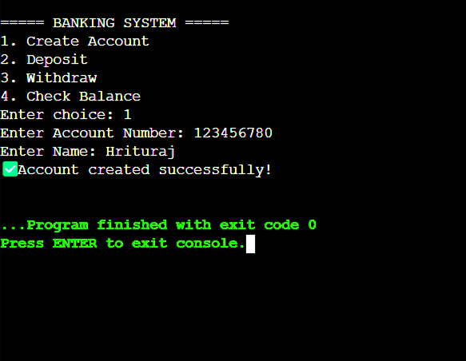
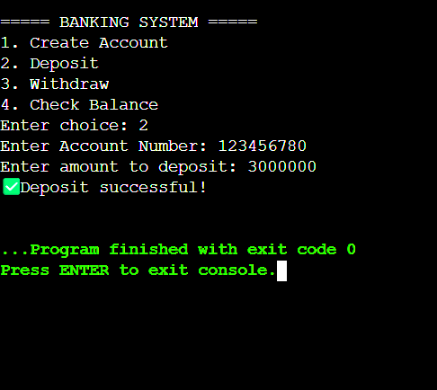
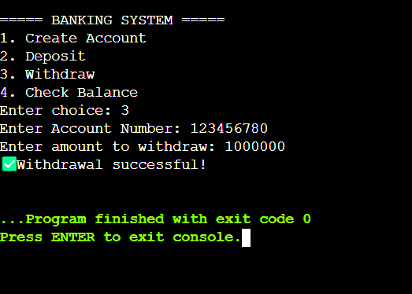
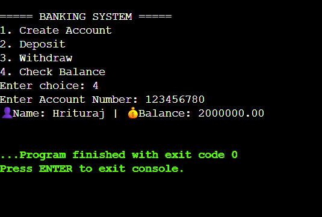

# 🏦Banking Management System

A **command-line banking application** built in C that provides essential banking operations with persistent file-based storage.

## 📌 Overview

This project implements a fundamental banking system that allows users to perform core banking operations through an intuitive command-line interface. All account data is securely stored in binary files, ensuring data persistence across program sessions.

## ✨ Features

- **Account Management**
  - Create new bank accounts with auto-generated unique account numbers.
  - Store account holder information securely.
  
- **Transaction Operations**
  - Deposit funds with real-time balance updates.
  - Withdraw funds with automatic balance validation.
  - View current account balance and holder details.
  
- **Data Persistence**
  - Binary file storage (`bank.dat`) for reliable data retention.
  - Automatic file creation and management.
  - Data integrity across program sessions.

## 🛠️ Technical Stack

- **Language -** C (ANSI C compatible).
- **Compiler -** GCC (GNU Compiler Collection).
- **File I/O -** Standard C library functions (`fopen`, `fwrite`, `fread`, `fseek`, `fclose`).
- **Storage -** Binary file format for optimized performance.

## 💻 Usage Guide

### Main Menu Interface
```
===== BANKING SYSTEM =====
1. Create Account
2. Deposit
3. Withdraw
4. Check Balance
5. Exit
Enter choice: 
```

### Sample Workflow

**Creating a New Account**
```
Enter choice: 1
Enter Account Number: 1001
Enter Name: John
✅Account created successfully!
```
<p align="center">
  
</p>

**Making a Deposit**
```
Enter choice: 2
Enter Account Number: 1001
Enter amount to deposit: 5000
✅Deposit successful!
```
<p align="center">
  
</p>

**Withdrawing Funds**
```
Enter choice: 3
Enter Account Number: 1001
Enter amount to withdraw: 2000
✅Withdrawal successful!
```
<p align="center">
  
</p>

**Checking Balance**
```
Enter choice: 4
Enter Account Number: 1001
👤Name: John | 💰Balance: 3000.00
```
<p align="center">
  
</p>

## 🗃️ Data Structure

The application uses the following account structure -

```c
struct Account {
    int acc_no;        // Unique account identifier
    char name[50];     // Account holder name
    float balance;     // Current account balance
};
```

## 🔧 Error Handling

- **Invalid Account Numbers -** Prompts user to enter valid existing account number.
- **Insufficient Funds -** Prevents overdrafts with balance validation.
- **File Access Issues -** Graceful handling of file I/O errors.
- **Input Validation -** Checks for proper data types and ranges.

## 📊 File Management

- **Storage Format -** Binary file (`bank.dat`) for efficient data storage.
- **Auto-Creation -** Data file is created automatically on first run.
- **Data Integrity -** Safe read/write operations with proper file handling.
- **Backup Recommendation -** Regularly backup `bank.dat` for data safety.

## 🔮 Future Enhancements

  - PIN-based authentication system.
  - Data encryption for sensitive information.
  - Transaction history and statements.
  - Account deletion capability.
  - Fund transfer between accounts.
  - Improved input validation.

