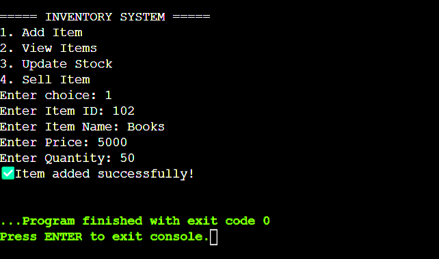
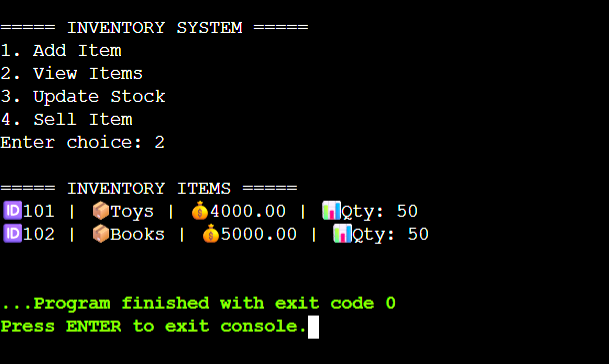
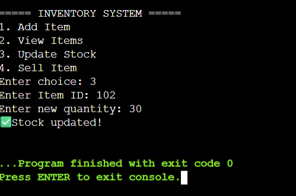
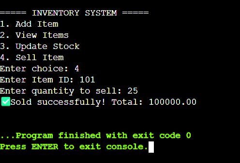
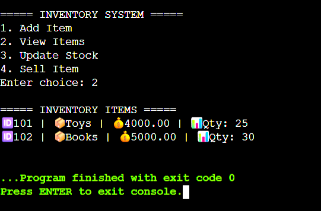

# 🛒Inventory Management System

A **command-line inventory management solution** built in C, designed for small to medium-sized retail businesses to efficiently track and manage their product inventory.

## 📌 Overview

This project provides a comprehensive inventory management system that enables store owners and managers to handle essential inventory operations through an intuitive command-line interface. The system offers real-time inventory tracking with persistent file-based storage, making it ideal for small retail establishments, warehouses or personal inventory management.

## ✨ Features

- **Item Management**
  - Add new products with unique identification numbers.
  - Store comprehensive item details (ID, name, price, quantity).
  - Automated inventory updates with real-time stock tracking.

- **Stock Management**
  - Update stock quantities for existing items.
  - Real-time inventory level monitoring.
  - Low stock alerts and warnings.

- **Sales Processing**
  - Process item sales with automatic stock deduction.
  - Validate stock availability before sales completion.
  - Instant inventory updates post-transaction.

- **Data Management**
  - Binary file storage (`inventory.dat`) for reliable data retention.
  - Automatic file creation and management.
  - Data integrity across program sessions.
  - Quick data retrieval and updates.

## 🛠️ Technical Stack

- **Programming Language -** C (ANSI C compatible).
- **Compiler -** GCC (GNU Compiler Collection).
- **File Operations -** Standard C library (`fopen`, `fwrite`, `fread`, `fseek`, `fclose`).
- **Data Storage -** Optimized binary file format.
- **Platform -** Cross-platform (Linux, macOS, Windows).

## 🚀 Getting Started

### Prerequisites

- **GCC Compiler** installed on your system.
- **Terminal/Command Prompt** access.
- **Minimum System Requirements -**
  - 1MB free disk space.
  - Any modern operating system (Linux, macOS, Windows).

## 💻 User Guide

### Main Menu Interface
```
===========INVENTORY SYSTEM============
1. Add Item
2. View Items
3. Update Stock
4. Sell Item
=======================================
Enter choice: 
```

### Detailed Operations

#### **Adding New Items**
```
Enter choice: 1
Enter Item ID: 101
Enter Item Name: Wireless Headphones
Enter Price: 5000
Enter Quantity: 25
✅Item added successfully!
```

<p align="center">
  
</p>

#### **Viewing Inventory**
```
Enter choice: 2

====== INVENTORY ITEMS=======
🆔101 | 📦Wireless Headphones | 💰5000.00 | 📊Qty: 25
```
<p align="center">
  
</p>

#### **Updating Stock**
```
Enter choice: 3
Enter Item ID: 101
Enter new Quantity: 50
✅Stock updated!
```
<p align="center">
  
</p>

#### **Selling Items**
```
Enter choice: 4
Enter Item ID: 101
Enter quantity to sell: 25
✅Sold successfully! Total: 100000.00
```
<p align="center">
  
</p>

<p align="center">
  
</p>

## 🗃️ Data Structure

The system utilizes the following item structure for efficient data management -

```c
struct Item {
    int id;           // Unique item identifier
    char name[50];    // Product name/description
    float price;      // Unit price in currency
    int quantity;     // Available stock quantity
};
```

## 🔧 Error Handling & Validation

### **Robust Input Validation**
- **Item ID Verification -** Prevents duplicate IDs and invalid entries.
- **Quantity Validation -** Ensures positive values and realistic limits.
- **Price Validation -** Validates monetary values and prevents negative prices.
- **Stock Availability -** Checks sufficient inventory before processing sales.

### **Error Management**
- **File Access Errors -** Graceful handling of file I/O issues.
- **Memory Management -** Proper allocation and deallocation.
- **Invalid Operations -** Clear error messages and recovery suggestions.
- **Data Corruption -** Built-in data integrity checks.

## 📊 Business Intelligence

### **Inventory Insights**
- Real-time stock level monitoring.
- Automatic low stock identification.
- Item valuation calculations.
- Sales impact on inventory levels.

### **Operational Benefits**
- **Time Efficiency -** Quick inventory operations and updates.
- **Accuracy -** Eliminates manual counting errors.
- **Reliability -** Persistent data storage prevents data loss.
- **Scalability -** Handles growing inventory needs.

## 🔮 Future Enhancements

  - Comprehensive sales tracking and history.
  - Revenue calculations and profit margins.
  - Generate detailed inventory reports.
  - Low stock alerts and notifications.
  - User authentication and access levels.
  - Concurrent access with file locking.

## 🎯 Use Cases

- Track product inventory in real-time.
- Process sales and update stock automatically.
- Monitor popular items and stock levels.
- Manage incoming and outgoing inventory.
- Track item locations and quantities.
- Generate stock reports for management.


